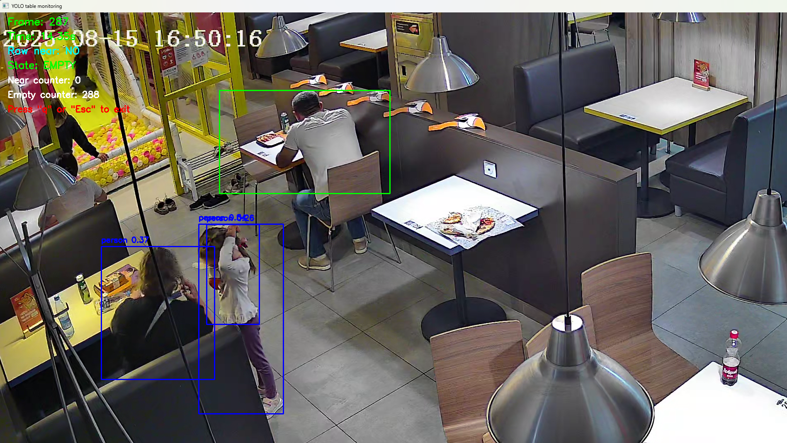
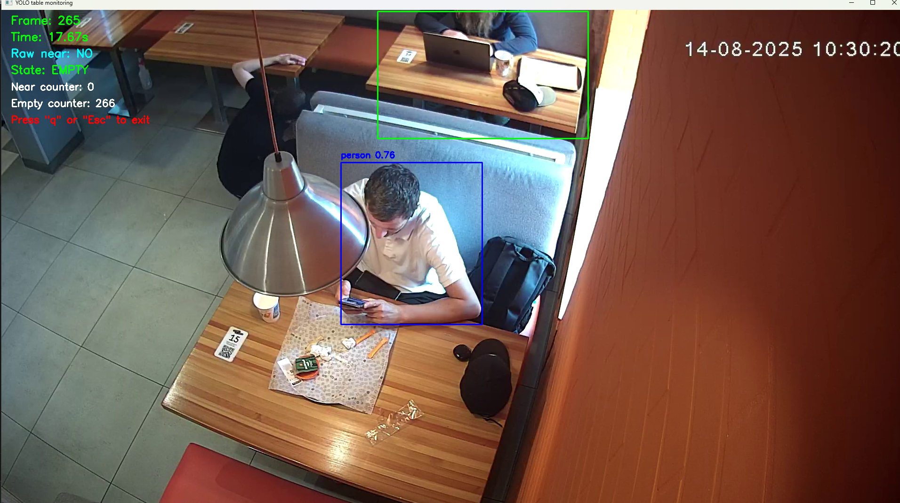
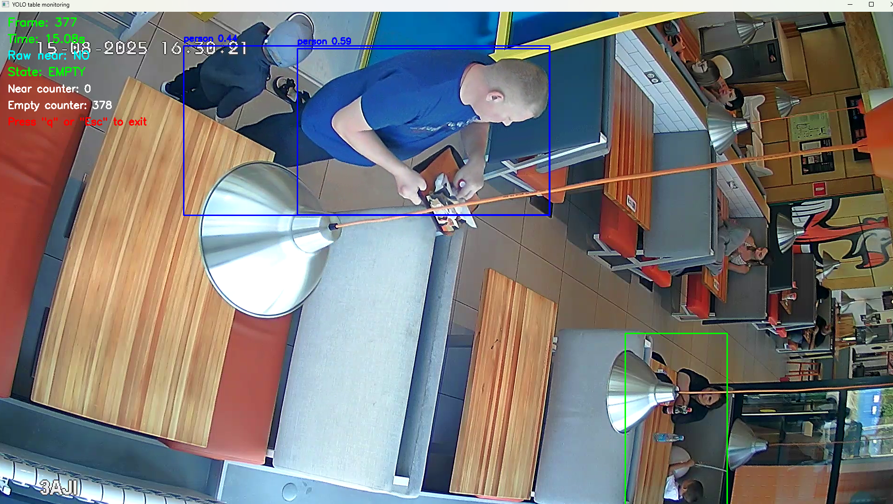
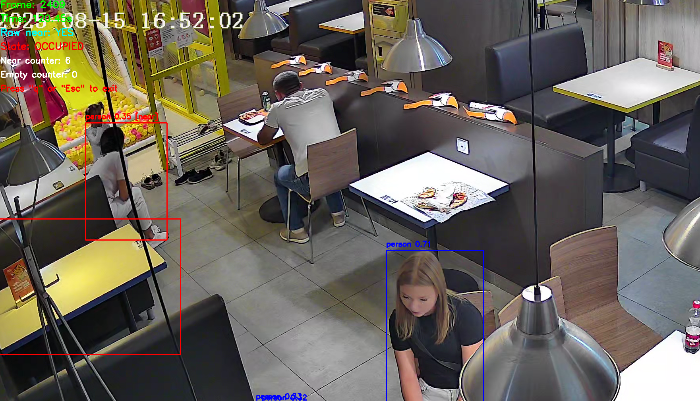

# Dodo People Detection Test

# Прототип детекции занятости столика (Computer Vision)

## 📌 Описание

Это прототип системы для анализа использования столика в ресторане (пиццерии) на основе видео.

Система определяет:

* когда стол становится пустым
* когда к нему подходит человек
* и рассчитывает время между этими событиями

Решение реализовано без обучения собственной модели — используется готовая YOLO-модель и простая логика анализа.

---

## 🎯 Используемое видео и столик

Для тестирования было выбрано:

* Видео: `video1.mp4`
* Столик: расположен в левой части кадра, примерно по центру по вертикали
* ROI (область столика) выбирался вручную через `cv2.selectROI`

---

## 🧠 Логика работы

### 1. Детекция людей

Используется модель **YOLOv8n (Ultralytics)** для обнаружения людей на каждом кадре.

---

### 2. Определение “человек у стола”

Текущая реализация:

* человек считается у стола, если его bounding box пересекается с ROI столика

---

### 3. Сглаживание (anti-flicker)

Используются счётчики кадров:

* `OCCUPIED_THRESHOLD = 16`
* `EMPTY_THRESHOLD = 24`

Это нужно, чтобы:

* убрать шум
* избежать мигания состояний

---

### 4. Машина состояний

Состояния:

* `EMPTY` — стол пуст
* `OCCUPIED` — стол занят

События:

* `approach_detected` — человек подошёл
* `table_became_empty` — стол освободился

---

### 5. Аналитика

Система:

* записывает события в `events.csv`
* рассчитывает задержки в `report.csv`

---

## 📊 Результаты

По выбранному участку видео:

👉 Среднее время между уходом и следующим подходом: **9.18 секунд**

- Всего событий обнаружено: **11**
- Количество рассчитанных задержек: **5**

Пример:

- стол освободился в **8.25с**
- следующий подход в **15.10с**
- задержка: **6.85с*

---

## 📁 Выходные файлы

* `output.mp4` — видео с визуализацией
* `events.csv` — список событий
* `report.csv` — расчёт задержек

---

## 🖼️ Проблемные случаи

### 1. Частичная видимость и отсутствие движения



Человек сидит спиной к камере и почти не двигается.
YOLO не обнаруживает его → стол считается пустым.

---

### 2. Человек частично вне кадра



Видна только часть тела → модель не распознаёт человека.

---

### 3. Перекрытие и расстояние



Люди далеко или перекрыты объектами → нестабильная детекция.

---

### 4. Ложное срабатывание (пересечение с ROI)



Человек сидит за соседним столом, но часть его (например кресло или тело) попадает в ROI выбранного столика.
Из-за этого система считает стол занятым, хотя фактически он пуст.

---

## ⚠️ Ограничения текущего подхода

* Простая логика пересечения bbox
* Нет трекинга объектов
* Нет разделения гостей и сотрудников
* Ошибки при частичной видимости
* Ошибки при перекрытиях

---

## 🛠️ Возможные улучшения

Для повышения точности можно:

* учитывать **процент пересечения bbox с ROI**
* проверять **центр bbox человека внутри ROI**
* добавить трекинг (например DeepSORT)
* использовать более сложную геометрию (IoU)

---

## 🚀 Запуск проекта

### 1. Клонировать репозиторий

```bash
git clone https://github.com/zufarzf/dodo-people-detection-test.git
cd dodo-people-detection-test
(Если файл взяли из письма этот шаг не обязателен)
(ps. В гит не удалось загрузить видео для теста.)
```

---

### 2. Создать виртуальное окружение

```bash
python -m venv venv
```

Активировать:

#### Windows:

```bash
venv\Scripts\activate
```

#### Linux / Mac:

```bash
source venv/bin/activate
```

---

### 3. Установить зависимости

```bash
pip install -r requirements.txt
```

---

### 4. Запустить

```bash
python main.py --video video1.mp4
```

---

## 💡 Примечание

Для ускорения работы анализировалась часть видео (не полный ролик), чтобы продемонстрировать логику работы системы.

---
